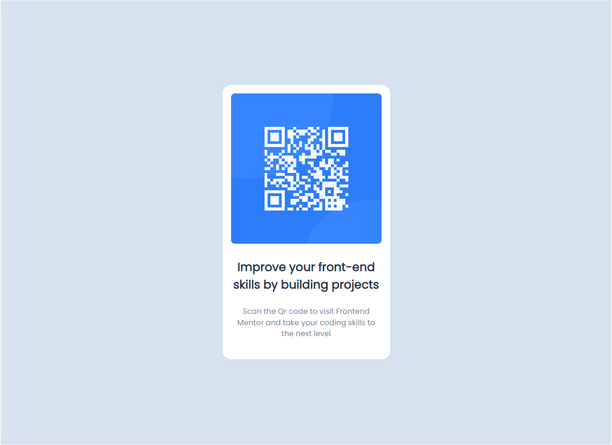

# Frontend Mentor - QR code component

## Welcome! 👋

Thanks for checking out my front-end coding challenge.

[Frontend Mentor](https://www.frontendmentor.io) QR code challenge.

### Built with

- Semantic HTML5 markup
- CSS custom properties
- Flexbox

## The challenge

Your challenge is to build out this QR code component and get it looking as close to the design as possible.

## Styling guide

The task is to build out the project to the designs inside the `/design` folder. You will find both a mobile and a desktop version of the design.

The designs are in JPG static format. Using JPGs will mean that you'll need to use your best judgment for styles such as `font-size`, `padding` and `margin`.

You will find all the required assets in the `/images` folder. The assets are already optimized.

There is also a `style-guide.md` file containing the information you'll need, such as color palette and fonts.
